# Topología de Internet con datos de CAIDA: la constante universal Δ

Análisis de la topología de Internet a nivel de **Sistemas Autónomos (AS)** usando el *AS Relationships Dataset* de [CAIDA](https://www.caida.org/). El proyecto construye el grafo de Internet, calcula sus métricas estructurales y estima la **constante universal Δ (γ)**: el exponente de la ley de potencias que sigue la distribución de grado, $P(k) \propto k^{-\gamma}$. Después explica qué significa esa constante y para qué sirve en el diseño de redes.

---

## Tabla de contenido

1. [Objetivos](#objetivos)
2. [Estructura del repositorio](#estructura-del-repositorio)
3. [Instalación](#instalación)
4. [Uso](#uso)
5. [El dataset de CAIDA](#el-dataset-de-caida)
6. [Metodología](#metodología)
7. [Resultados](#resultados)
8. [¿Qué representa Δ?](#qué-representa-δ)
9. [¿Para qué sirve Δ en el diseño de redes?](#para-qué-sirve-δ-en-el-diseño-de-redes)
10. [Nota: la δ de Gromov](#nota-la-δ-de-gromov)
11. [Referencias](#referencias)

---

## Objetivos

Las instrucciones del trabajo son:

1. Ir a CAIDA y escoger un dataset de la topología de Internet.
2. Analizar el dataset.
3. Encontrar la constante universal (Δ).
4. Explicar, en ese contexto, para qué sirve Δ y para qué sirve en el diseño.

## Estructura del repositorio

```
caida-delta-internet/
├── analisis_caida_delta.py    # Script principal: descarga, grafo, métricas, Δ, robustez, Gromov,
│                              # figuras y REESCRITURA AUTOMÁTICA de este README
├── validacion_sintetica.py    # Valida el método con un grafo Barabási–Albert (γ teórico = 3)
├── requirements.txt           # Dependencias de Python
├── data/                      # Archivos de CAIDA descargados (no se versionan)
├── resultados/                # CSV de grados y resumen en Markdown (no se versionan)
├── docs/
│   ├── resultados/            # Figuras con datos reales de CAIDA (se muestran abajo)
│   └── validacion/            # Figuras de la validación sintética
├── LICENSE
└── README.md
```

Los datos de CAIDA no se suben al repositorio porque pesan mucho y están sujetos a su [Acceptable Use Policy](https://www.caida.org/about/legal/aua/). Cualquiera puede regenerarlos ejecutando el script.

## Instalación

Se necesita Python 3.9 o superior.

```bash
git clone https://github.com/<tu-usuario>/caida-delta-internet.git
cd caida-delta-internet
python -m venv venv
source venv/bin/activate        # En Windows: venv\Scripts\activate
pip install -r requirements.txt
```

## Uso

```bash
# 1) Análisis completo con descarga automática del snapshot de enero de 2024
python analisis_caida_delta.py

# 2) Elegir otro snapshot (siempre el día 01 de un mes)
python analisis_caida_delta.py --fecha 20260801

# 3) Usar un archivo descargado a mano
python analisis_caida_delta.py --archivo data/20240101.as-rel.txt.bz2

# 4) Omitir la δ de Gromov (más rápido)
python analisis_caida_delta.py --sin-hiperbolicidad

# 5) Analizar sin modificar este README
python analisis_caida_delta.py --no-readme

# Validación del método con datos sintéticos
python validacion_sintetica.py
```

Si la descarga automática falla por proxy o firewall, descargue el archivo `AAAAMMDD.as-rel.txt.bz2` desde <https://publicdata.caida.org/datasets/as-relationships/serial-1/>, guárdelo en `data/` y use `--archivo`.

**Salidas:**

- La consola muestra todas las métricas, las cuatro estimaciones de γ, las pruebas estadísticas, la robustez y la δ de Gromov.
- `docs/resultados/*.png` contiene ocho figuras: resumen, composición del dataset, PDF log-log, CCDF con MLE, ley de rango, distancias, robustez y Gromov.
- **`README.md` se actualiza solo.** El script reescribe la sección [Resultados](#resultados) con tablas, figuras e interpretación de los datos reales, delimitada por dos comentarios HTML invisibles (`INICIO:RESULTADOS` y `FIN:RESULTADOS`). El resto del README no se toca.
- `resultados/grados_<fecha>.csv` guarda el grado de cada AS, y `resultados/resumen_<fecha>.md` una copia de la sección generada.

### Flujo para publicar en GitHub

```bash
python analisis_caida_delta.py          # descarga, analiza y reescribe el README (5–15 min)
git add README.md docs/
git commit -m "Resultados con snapshot CAIDA"
git push
```

## El dataset de CAIDA

Se usa el **CAIDA AS Relationships Dataset (serial-1)**. CAIDA lo infiere mensualmente a partir de las tablas BGP públicas de RouteViews y RIPE RIS, y [su página del catálogo](https://www.caida.org/catalog/datasets/as-relationships/) describe el dataset completo.

Cada línea representa un enlace entre dos Sistemas Autónomos:

```
# líneas de comentario
<AS1>|<AS2>|-1     →  AS1 es PROVEEDOR de tránsito de AS2 (provider-to-customer)
<AS1>|<AS2>|0      →  AS1 y AS2 son PARES (peer-to-peer, típicamente en un IXP)
```

La red se modela como un **grafo no dirigido** $G = (V, E)$:

- **Nodos $V$:** cada nodo es un Sistema Autónomo, es decir, una red bajo una sola política de enrutamiento. Puede ser un ISP, una universidad, un proveedor de nube, etc.
- **Enlaces $E$:** cada enlace es una relación comercial de interconexión BGP entre dos AS.

Se usa un grafo no dirigido porque la conectividad es bidireccional. El tipo de relación se conserva para las estadísticas.

## Metodología

### 1. Análisis estructural

| Métrica | Definición | Interés |
|---|---|---|
| $N$, $E$ | Número de AS y de enlaces | Tamaño de la red |
| $\langle k \rangle = 2E/N$ | Grado promedio | Conectividad media |
| $\langle k^2 \rangle$ | Segundo momento del grado | Heterogeneidad; diverge si $\gamma < 3$ |
| $k_{max}$ | Grado máximo | Tamaño del mayor hub |
| $C$ | Coeficiente de clustering medio | Formación de triángulos (peering regional) |
| $\langle \ell \rangle$, diámetro | Distancias en saltos AS (estimadas por muestreo BFS) | Propiedad de mundo pequeño |
| $r$ | Asortatividad de grado | $r<0$: los hubs se conectan con nodos pequeños |
| $\kappa = \langle k^2 \rangle / \langle k \rangle$ | Criterio de Molloy-Reed | Existe componente gigante si $\kappa > 2$ |

El clustering se calcula de forma aproximada y las distancias por muestreo. El cálculo exacto es muy lento porque existen hubs con más de 10⁴ vecinos.

### 2. Cálculo de la constante universal Δ (γ)

Si $P(k) = C\,k^{-\gamma}$, al tomar logaritmos se obtiene una **recta en escala log-log**:

$$\log P(k) = -\gamma \,\log k + \log C$$

Por lo tanto, **Δ es el valor absoluto de la pendiente**. El script la estima con cuatro métodos independientes que se validan entre sí:

| Método | Qué ajusta | Cómo se obtiene γ |
|---|---|---|
| **A. PDF log-log** | Regresión lineal sobre $P(k)$ con *binning* logarítmico, que reduce el ruido de la cola | $\gamma = -\text{pendiente}$ |
| **B. CCDF** | Regresión sobre $P(K \ge k) \propto k^{-(\gamma-1)}$ | $\gamma = 1 - \text{pendiente}$ |
| **C. Ley de rango (Faloutsos, 1999)** | $d_r \propto r^{R}$ (grado contra posición en el ranking) | $\gamma = 1 - 1/R$ |
| **D. Máxima verosimilitud (Clauset–Shalizi–Newman, 2009)** | MLE discreto con $k_{min}$ óptimo por distancia de Kolmogorov–Smirnov | $\hat\gamma = 1 + n\left[\sum \ln \frac{k_i}{k_{min}-1/2}\right]^{-1}$ |

**El método D es el valor que se reporta** porque es el estándar académico. Las regresiones por mínimos cuadrados en log-log están sesgadas: los puntos de la cola tienen muy pocas observaciones y el error no es homocedástico.

El método D también compara, mediante una prueba de razón de verosimilitudes, la ley de potencias contra una distribución exponencial y una lognormal. Si $R > 0$ con $p < 0.1$, la ley de potencias es la mejor explicación.

### 3. Robustez

El script elimina una fracción creciente $f$ de AS de dos maneras: al azar (fallos) o por grado descendente (ataque dirigido a los hubs). En cada paso mide el tamaño relativo $S$ de la componente gigante. Así muestra empíricamente la consecuencia práctica del valor de γ.

### 4. Validación del método

`validacion_sintetica.py` genera un grafo **Barabási–Albert** con $N = 20\,000$ nodos, cuyo exponente teórico es exactamente $\gamma = 3$. Lo guarda en formato CAIDA y le aplica el análisis completo. Si el script recupera γ ≈ 3, el método es correcto. La pequeña desviación esperada se debe a efectos de tamaño finito, bien conocidos en el modelo BA.

<details>
<summary><b>Ver resultados completos de la validación</b> (clic para desplegar)</summary>

<!-- INICIO:VALIDACION -->

### Validación con datos sintéticos

> Sección generada automáticamente por `analisis_caida_delta.py` el 2026-09-24 11:52 (tiempo de ejecución: 1.0 min).

**Archivo analizado:** `sintetico_BA.as-rel.txt.bz2`  
**Snapshot:** `sintetico_BA`

#### Resumen

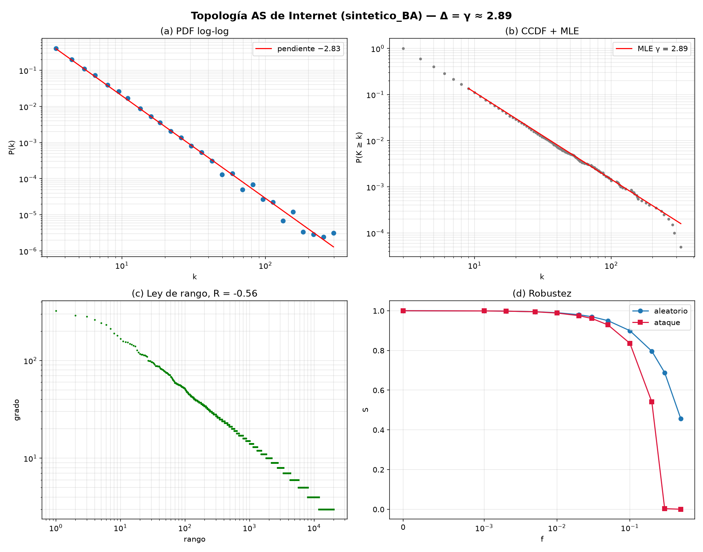

| Resultado principal | Valor |
|---|---|
| **Constante universal Δ = γ (MLE)** | **2.885** ± 0.036 |
| Sistemas Autónomos (nodos) | 20,000 |
| Enlaces | 59,991 |
| Grado promedio ⟨k⟩ | 6.00 |
| Grado máximo | 323 |

**2 < γ < 3 → régimen libre de escala.** ⟨k⟩ es finito pero ⟨k²⟩ diverge al crecer N; la red es un *mundo ultra-pequeño* y extremadamente robusta ante fallos aleatorios.

#### 1. Estadísticas del dataset

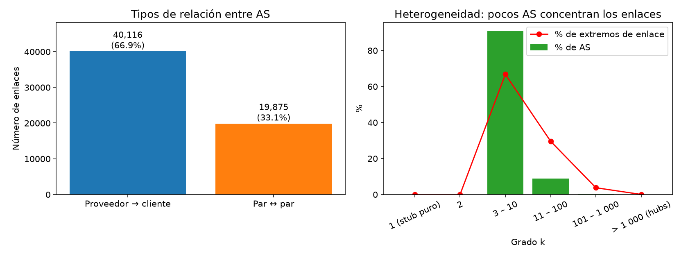

| Métrica | Valor | Comentario |
|---|---|---|
| Nodos N (AS) | 20,000 | Redes con política de enrutamiento propia |
| Enlaces E | 59,991 | Relaciones BGP inferidas |
| Enlaces proveedor → cliente | 40,116 (66.9 %) | Tránsito pagado (rel = −1) |
| Enlaces par ↔ par | 19,875 (33.1 %) | Peering, típicamente en IXPs (rel = 0) |
| Grado promedio ⟨k⟩ | 5.999 | 2E / N |
| Grado mediano | 4 | Mucho menor que ⟨k⟩: distribución sesgada |
| Segundo momento ⟨k²⟩ | 114.3 | Enorme frente a ⟨k⟩² = 36.0 |
| Grado mínimo / máximo | 3 / 323 | El mayor hub toca el 1.6 % de la red |
| Densidad | 3.00e-04 | Red muy dispersa |
| Componentes conexas | 1 |  |
| Fracción en componente gigante | 100.00 % |  |
| Clustering medio C | 0.0026 | Aproximado (20 000 muestras) |
| Longitud media de camino ⟨ℓ⟩ | 4.533 | ln N = 9.90; ln ln N = 2.29 |
| Diámetro (cota inferior) | 7 | Por muestreo BFS |
| Asortatividad r | -0.0344 | r < 0: disasortativa |
| κ = ⟨k²⟩ / ⟨k⟩ | 19.05 | Criterio de Molloy-Reed (> 2: hay componente gigante) |

**Distribución de los AS por clase de grado**

| Grado k | N.º de AS | % de AS | % de extremos de enlace |
|---|---|---|---|
| 1 (stub puro) | 0 | 0.00 % | 0.00 % |
| 2 | 0 | 0.00 % | 0.00 % |
| 3 – 10 | 18,188 | 90.94 % | 66.75 % |
| 11 – 100 | 1,786 | 8.93 % | 29.54 % |
| 101 – 1 000 | 26 | 0.13 % | 3.72 % |
| > 1 000 (hubs) | 0 | 0.00 % | 0.00 % |

**Los 15 AS con mayor grado** (enlace a su ficha en CAIDA AS Rank)

| # | ASN | Grado | % de la red | Clientes | Proveedores | Pares |
|---|---|---|---|---|---|---|
| 1 | [AS0](https://asrank.caida.org/asns/0) | 323 | 1.62 % | 211 | 0 | 112 |
| 2 | [AS20](https://asrank.caida.org/asns/20) | 289 | 1.45 % | 200 | 3 | 86 |
| 3 | [AS1](https://asrank.caida.org/asns/1) | 281 | 1.41 % | 194 | 1 | 86 |
| 4 | [AS4](https://asrank.caida.org/asns/4) | 262 | 1.31 % | 162 | 2 | 98 |
| 5 | [AS13](https://asrank.caida.org/asns/13) | 243 | 1.22 % | 160 | 2 | 81 |
| 6 | [AS9](https://asrank.caida.org/asns/9) | 233 | 1.17 % | 145 | 2 | 86 |
| 7 | [AS7](https://asrank.caida.org/asns/7) | 212 | 1.06 % | 137 | 3 | 72 |
| 8 | [AS17](https://asrank.caida.org/asns/17) | 189 | 0.95 % | 127 | 3 | 59 |
| 9 | [AS24](https://asrank.caida.org/asns/24) | 180 | 0.90 % | 127 | 1 | 52 |
| 10 | [AS8](https://asrank.caida.org/asns/8) | 167 | 0.84 % | 107 | 3 | 57 |
| 11 | [AS14](https://asrank.caida.org/asns/14) | 157 | 0.79 % | 92 | 2 | 63 |
| 12 | [AS60](https://asrank.caida.org/asns/60) | 155 | 0.78 % | 109 | 3 | 43 |
| 13 | [AS5](https://asrank.caida.org/asns/5) | 153 | 0.77 % | 97 | 2 | 54 |
| 14 | [AS67](https://asrank.caida.org/asns/67) | 148 | 0.74 % | 111 | 2 | 35 |
| 15 | [AS12](https://asrank.caida.org/asns/12) | 146 | 0.73 % | 89 | 2 | 55 |

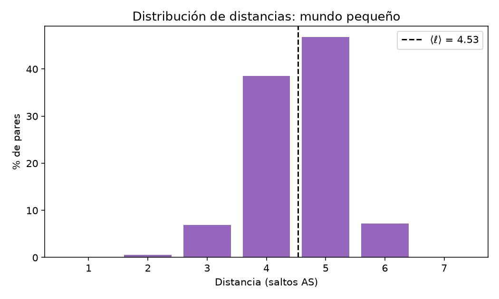

#### 2. Cálculo de la constante universal Δ (γ)

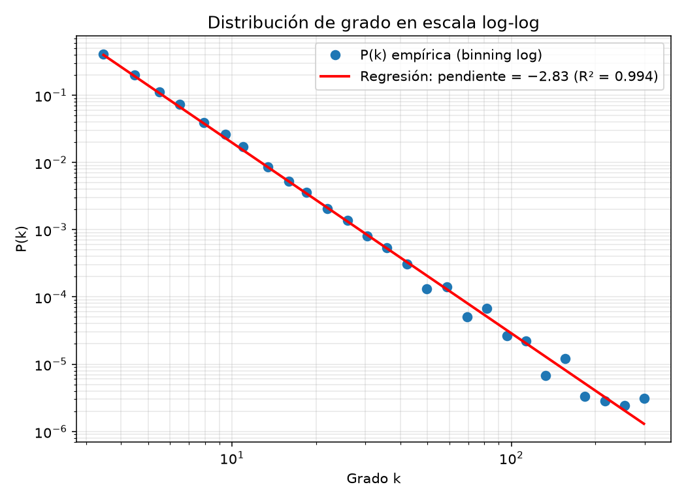

La recta de la figura es $\log P(k) = -\gamma\,\log k + c$. Su pendiente es **−2.835**, así que Δ = γ ≈ 2.83 por este método.

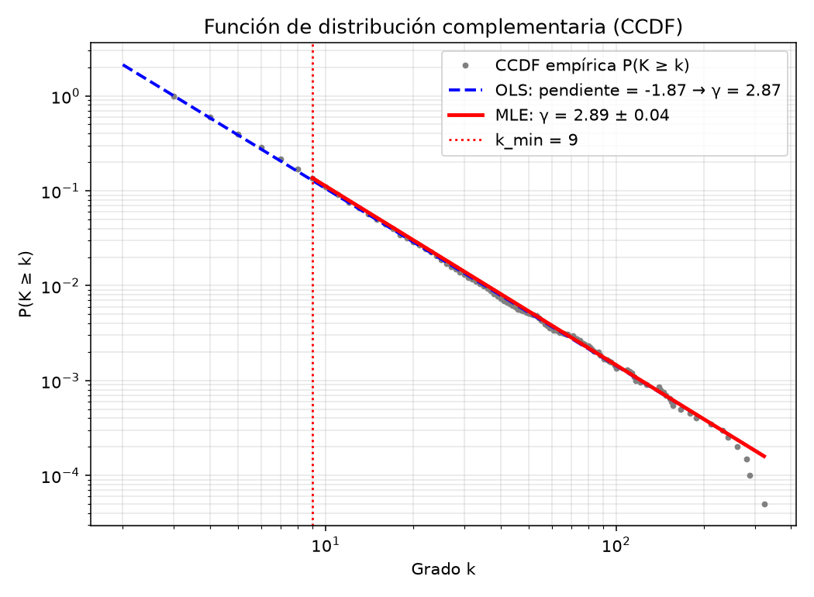

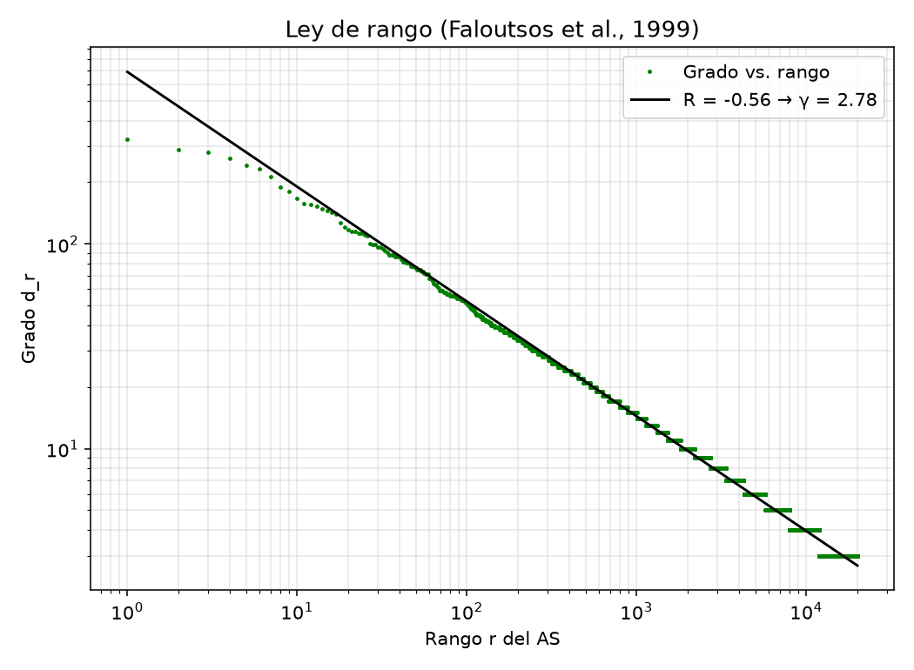

| Método | Pendiente medida | γ estimado | Calidad |
|---|---|---|---|
| A. Regresión PDF log-log | -2.835 | 2.835 | R² = 0.9941 |
| B. Regresión CCDF | -1.868 | 2.868 | R² = 0.9992 |
| C. Ley de rango (Faloutsos) | R = -0.561 | 2.784 | R² = 0.9850 |
| **D. Máxima verosimilitud (CSN 2009)** | — | **2.885 ± 0.036** | KS = 0.0076; k_min = 9; cola = 2,720 AS (13.6 %) |

**Pruebas de razón de verosimilitud** (ley de potencias contra alternativas)

| Alternativa | R normalizado | p-valor | Veredicto |
|---|---|---|---|
| Exponencial | +8.286 | 1.17e-16 | Favorece ley de potencias |
| Lognormal | -0.324 | 0.746 | No concluyente (ambas plausibles) |
| Ley de potencias truncada | -0.591 | 0.495 | No concluyente (ambas plausibles) |
| Exponencial estirada | +2.170 | 0.03 | Favorece ley de potencias |

Si R > 0 con p < 0.1, la ley de potencias ajusta mejor. Es habitual que la ley de potencias truncada o la lognormal resulten igual de plausibles en datos reales: la cola de Internet decae algo más rápido en los grados más altos por límites físicos y económicos.

#### 3. Robustez: consecuencia práctica de Δ

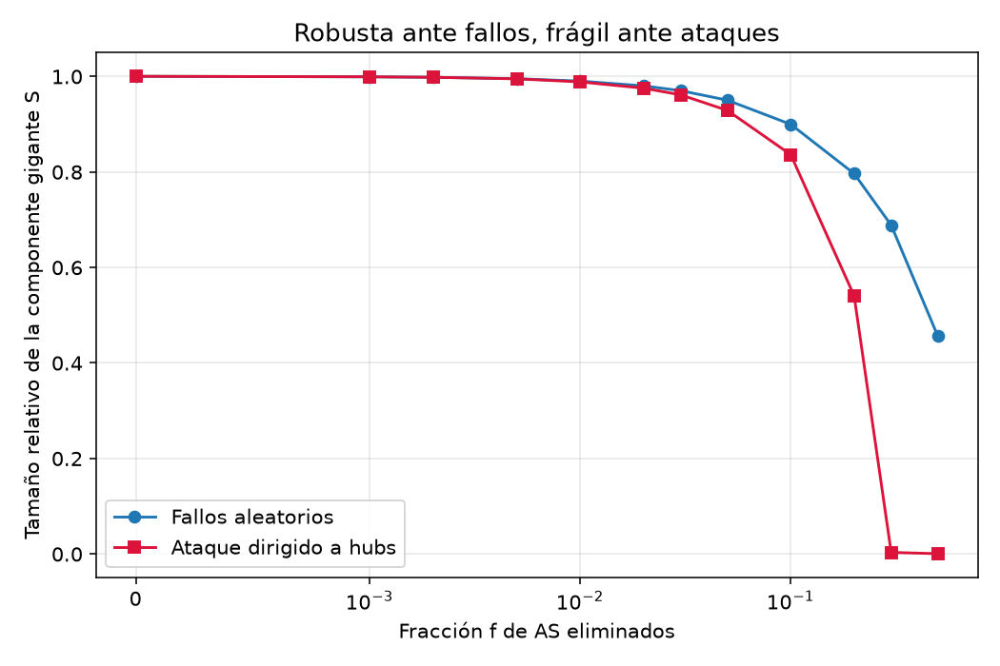

| Fracción eliminada f | S (fallos aleatorios) | S (ataque a hubs) |
|---|---|---|
| 0.0 % | 1.000 | 1.000 |
| 0.1 % | 0.999 | 0.999 |
| 0.2 % | 0.998 | 0.998 |
| 0.5 % | 0.995 | 0.995 |
| 1.0 % | 0.990 | 0.988 |
| 2.0 % | 0.980 | 0.975 |
| 3.0 % | 0.970 | 0.961 |
| 5.0 % | 0.950 | 0.929 |
| 10.0 % | 0.899 | 0.836 |
| 20.0 % | 0.796 | 0.540 |
| 30.0 % | 0.688 | 0.003 |
| 50.0 % | 0.456 | 0.000 |

- Umbral teórico ante fallos aleatorios (Molloy-Reed): $f_c = 1 - 1/(\kappa-1)$ = **94.5 %** de los AS.
- Ante ataque dirigido, la componente gigante cae por debajo del 5 % al eliminar **30.0 %** de los AS.

#### 4. Hiperbolicidad δ de Gromov

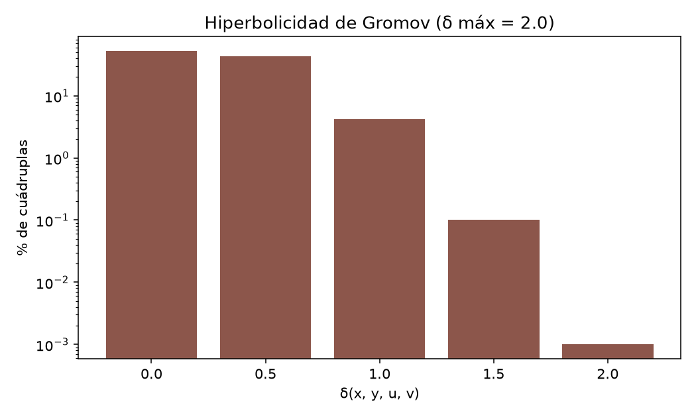

Se muestrearon 200,000 cuádruplas de nodos de la componente gigante. **δ máximo = 2.0** y δ medio = 0.261. Un valor tan pequeño frente al diámetro indica que la red es *similar a un árbol* a gran escala, con curvatura negativa.

| δ | % de cuádruplas |
|---|---|
| 0.0 | 52.230 % |
| 0.5 | 43.409 % |
| 1.0 | 4.258 % |
| 1.5 | 0.102 % |
| 2.0 | 0.001 % |


<!-- FIN:VALIDACION -->

</details>

## Resultados

Esta sección la escribe automáticamente `analisis_caida_delta.py` con los datos reales del snapshot de CAIDA analizado. Contiene las estadísticas del dataset, la jerarquía de AS, el cálculo de Δ por cuatro métodos, las pruebas estadísticas, la robustez y la hiperbolicidad.

Como referencia, la literatura reporta para snapshots recientes de CAIDA unos 75 000 AS, unos 500 000 enlaces, ⟨k⟩ ≈ 13, ⟨ℓ⟩ ≈ 3.5–4 saltos, r ≈ −0.2 y **γ ≈ 2.0–2.3**. Faloutsos et al. (1999) reportaron γ ≈ 2.2 cuando Internet tenía unos 4 000 AS. Que el valor se mantenga con una red más de 15 veces mayor es lo que justifica llamarlo **constante universal**.

<!-- INICIO:RESULTADOS -->

### Resultados con datos de CAIDA

> Sección generada automáticamente por `analisis_caida_delta.py` el 2026-09-24 11:50 (tiempo de ejecución: 6.2 min).

**Archivo analizado:** `20240101.as-rel.txt.bz2`  
**Fuente declarada en el archivo:** `source:topology|BGP|20240101|ripe|rrc00`  
**Snapshot:** `20240101`

#### Resumen

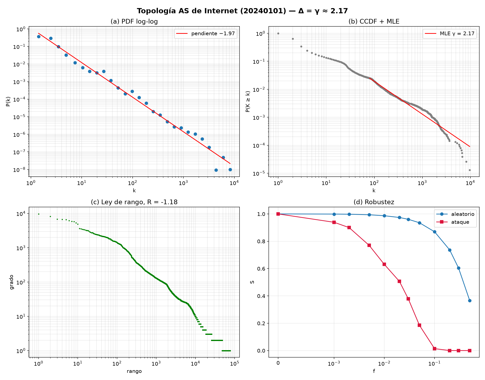

| Resultado principal | Valor |
|---|---|
| **Constante universal Δ = γ (MLE)** | **2.172** ± 0.027 |
| Sistemas Autónomos (nodos) | 76,351 |
| Enlaces | 499,651 |
| Grado promedio ⟨k⟩ | 13.09 |
| Grado máximo | 9,696 |

**2 < γ < 3 → régimen libre de escala.** ⟨k⟩ es finito pero ⟨k²⟩ diverge al crecer N; la red es un *mundo ultra-pequeño* y extremadamente robusta ante fallos aleatorios.

#### 1. Estadísticas del dataset

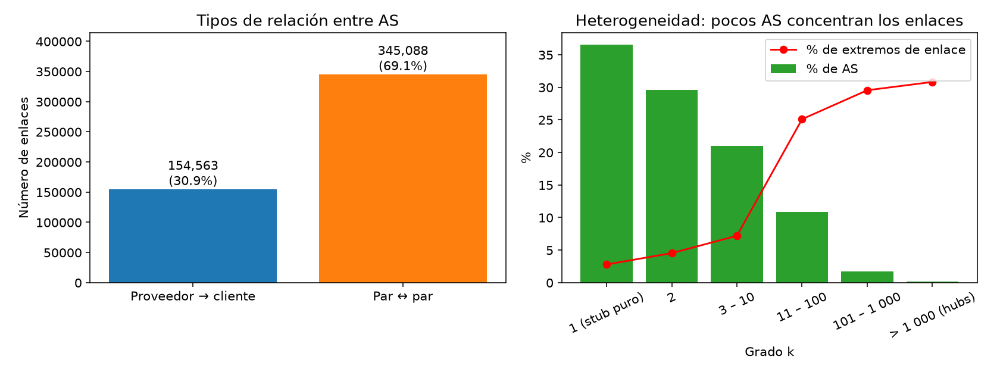

| Métrica | Valor | Comentario |
|---|---|---|
| Nodos N (AS) | 76,351 | Redes con política de enrutamiento propia |
| Enlaces E | 499,651 | Relaciones BGP inferidas |
| Enlaces proveedor → cliente | 154,563 (30.9 %) | Tránsito pagado (rel = −1) |
| Enlaces par ↔ par | 345,088 (69.1 %) | Peering, típicamente en IXPs (rel = 0) |
| Grado promedio ⟨k⟩ | 13.088 | 2E / N |
| Grado mediano | 2 | Mucho menor que ⟨k⟩: distribución sesgada |
| Segundo momento ⟨k²⟩ | 13,935.3 | Enorme frente a ⟨k⟩² = 171.3 |
| Grado mínimo / máximo | 1 / 9,696 | El mayor hub toca el 12.7 % de la red |
| Densidad | 1.71e-04 | Red muy dispersa |
| Componentes conexas | 1 |  |
| Fracción en componente gigante | 100.00 % |  |
| Clustering medio C | 0.2846 | Aproximado (20 000 muestras) |
| Longitud media de camino ⟨ℓ⟩ | 3.666 | ln N = 11.24; ln ln N = 2.42 |
| Diámetro (cota inferior) | 10 | Por muestreo BFS |
| Asortatividad r | -0.2691 | r < 0: disasortativa |
| κ = ⟨k²⟩ / ⟨k⟩ | 1064.72 | Criterio de Molloy-Reed (> 2: hay componente gigante) |

**Distribución de los AS por clase de grado**

| Grado k | N.º de AS | % de AS | % de extremos de enlace |
|---|---|---|---|
| 1 (stub puro) | 27,903 | 36.55 % | 2.79 % |
| 2 | 22,621 | 29.63 % | 4.53 % |
| 3 – 10 | 16,066 | 21.04 % | 7.20 % |
| 11 – 100 | 8,306 | 10.88 % | 25.11 % |
| 101 – 1 000 | 1,311 | 1.72 % | 29.55 % |
| > 1 000 (hubs) | 144 | 0.19 % | 30.82 % |

**Los 15 AS con mayor grado** (enlace a su ficha en CAIDA AS Rank)

| # | ASN | Grado | % de la red | Clientes | Proveedores | Pares |
|---|---|---|---|---|---|---|
| 1 | [AS6939](https://asrank.caida.org/asns/6939) | 9,696 | 12.70 % | 2,202 | 3 | 7,491 |
| 2 | [AS24482](https://asrank.caida.org/asns/24482) | 8,226 | 10.77 % | 39 | 5 | 8,182 |
| 3 | [AS49544](https://asrank.caida.org/asns/49544) | 6,803 | 8.91 % | 31 | 7 | 6,765 |
| 4 | [AS174](https://asrank.caida.org/asns/174) | 6,692 | 8.76 % | 6,609 | 0 | 83 |
| 5 | [AS3356](https://asrank.caida.org/asns/3356) | 6,558 | 8.59 % | 6,481 | 0 | 77 |
| 6 | [AS199524](https://asrank.caida.org/asns/199524) | 6,228 | 8.16 % | 26 | 46 | 6,156 |
| 7 | [AS39120](https://asrank.caida.org/asns/39120) | 5,926 | 7.76 % | 15 | 4 | 5,907 |
| 8 | [AS1828](https://asrank.caida.org/asns/1828) | 5,819 | 7.62 % | 84 | 14 | 5,721 |
| 9 | [AS35280](https://asrank.caida.org/asns/35280) | 5,310 | 6.95 % | 58 | 4 | 5,248 |
| 10 | [AS37721](https://asrank.caida.org/asns/37721) | 4,879 | 6.39 % | 10 | 11 | 4,858 |
| 11 | [AS6057](https://asrank.caida.org/asns/6057) | 3,639 | 4.77 % | 27 | 10 | 3,602 |
| 12 | [AS263152](https://asrank.caida.org/asns/263152) | 3,597 | 4.71 % | 3 | 4 | 3,590 |
| 13 | [AS23106](https://asrank.caida.org/asns/23106) | 3,483 | 4.56 % | 165 | 6 | 3,312 |
| 14 | [AS47787](https://asrank.caida.org/asns/47787) | 3,424 | 4.48 % | 34 | 5 | 3,385 |
| 15 | [AS271253](https://asrank.caida.org/asns/271253) | 3,359 | 4.40 % | 134 | 5 | 3,220 |

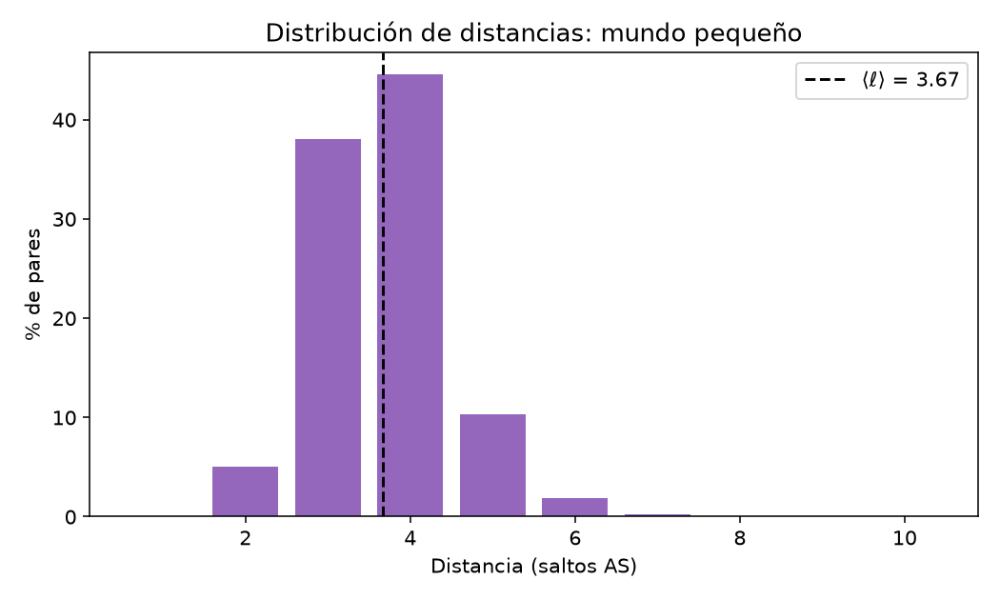

#### 2. Cálculo de la constante universal Δ (γ)

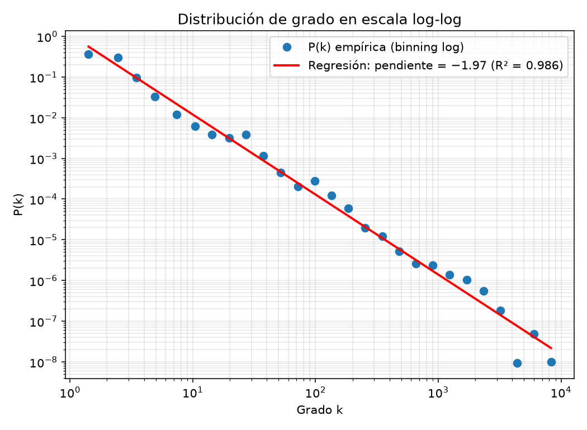

La recta de la figura es $\log P(k) = -\gamma\,\log k + c$. Su pendiente es **−1.966**, así que Δ = γ ≈ 1.97 por este método.

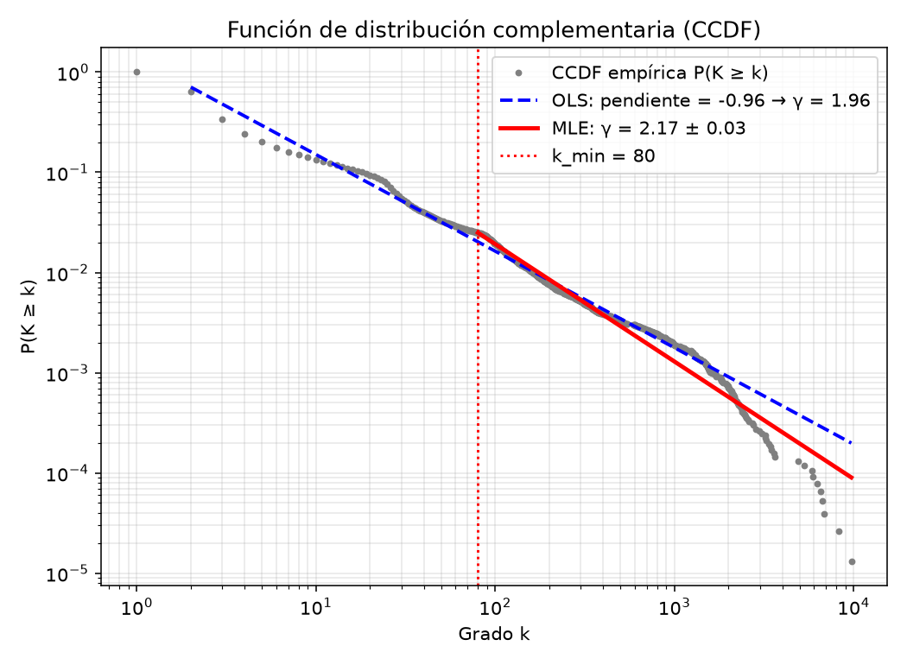

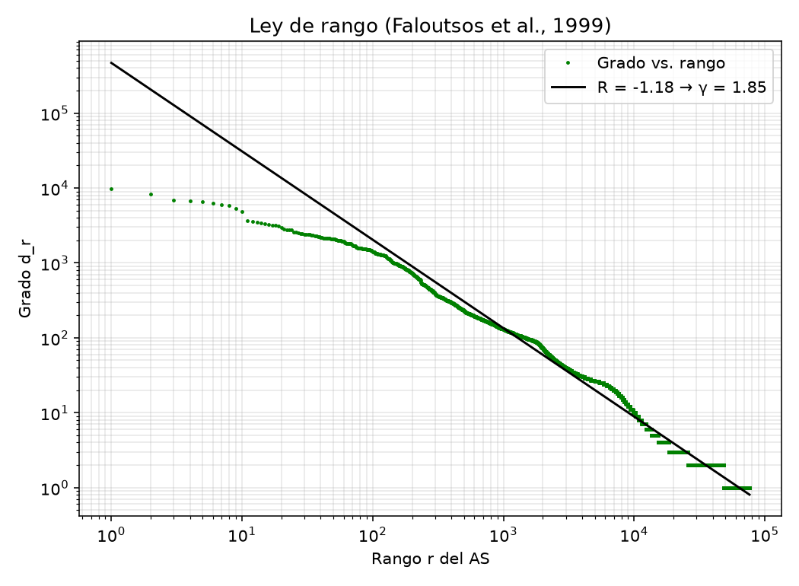

| Método | Pendiente medida | γ estimado | Calidad |
|---|---|---|---|
| A. Regresión PDF log-log | -1.966 | 1.966 | R² = 0.9856 |
| B. Regresión CCDF | -0.964 | 1.964 | R² = 0.9918 |
| C. Ley de rango (Faloutsos) | R = -1.181 | 1.847 | R² = 0.9725 |
| **D. Máxima verosimilitud (CSN 2009)** | — | **2.172 ± 0.027** | KS = 0.0448; k_min = 80; cola = 1,903 AS (2.5 %) |

**Pruebas de razón de verosimilitud** (ley de potencias contra alternativas)

| Alternativa | R normalizado | p-valor | Veredicto |
|---|---|---|---|
| Exponencial | +14.052 | 7.5e-45 | Favorece ley de potencias |
| Lognormal | +1.470 | 0.142 | No concluyente (ambas plausibles) |
| Ley de potencias truncada | -2.226 | 0.0639 | Favorece ley de potencias truncada |
| Exponencial estirada | +4.225 | 2.38e-05 | Favorece ley de potencias |

Si R > 0 con p < 0.1, la ley de potencias ajusta mejor. Es habitual que la ley de potencias truncada o la lognormal resulten igual de plausibles en datos reales: la cola de Internet decae algo más rápido en los grados más altos por límites físicos y económicos.

#### 3. Robustez: consecuencia práctica de Δ

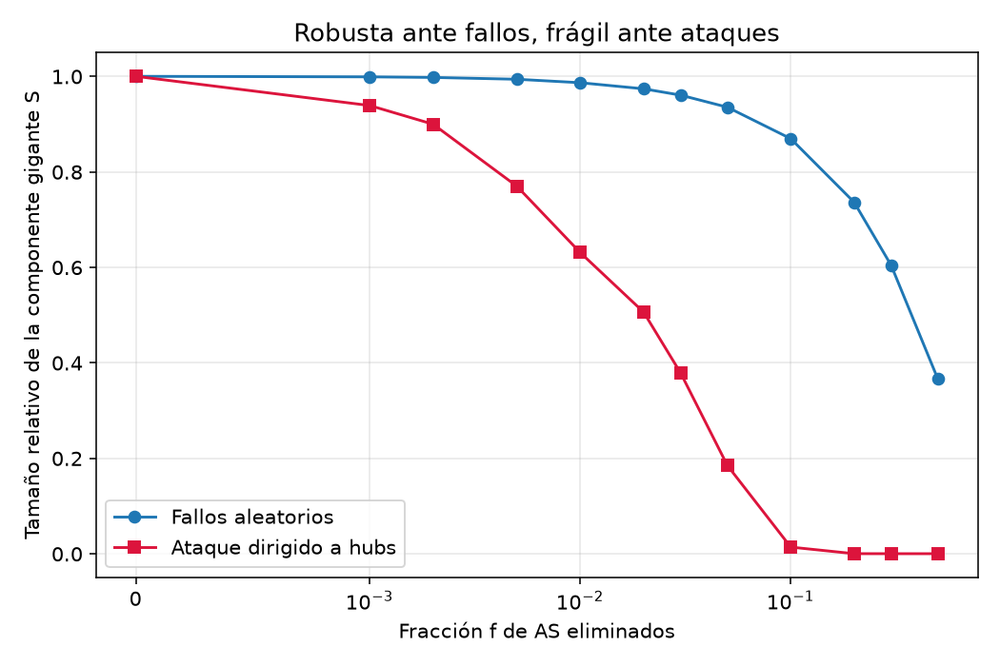

| Fracción eliminada f | S (fallos aleatorios) | S (ataque a hubs) |
|---|---|---|
| 0.0 % | 1.000 | 1.000 |
| 0.1 % | 0.999 | 0.939 |
| 0.2 % | 0.998 | 0.900 |
| 0.5 % | 0.994 | 0.770 |
| 1.0 % | 0.987 | 0.631 |
| 2.0 % | 0.974 | 0.506 |
| 3.0 % | 0.961 | 0.378 |
| 5.0 % | 0.935 | 0.185 |
| 10.0 % | 0.869 | 0.014 |
| 20.0 % | 0.736 | 0.000 |
| 30.0 % | 0.604 | 0.000 |
| 50.0 % | 0.366 | 0.000 |

- Umbral teórico ante fallos aleatorios (Molloy-Reed): $f_c = 1 - 1/(\kappa-1)$ = **99.9 %** de los AS.
- Ante ataque dirigido, la componente gigante cae por debajo del 5 % al eliminar **10.0 %** de los AS.

#### 4. Hiperbolicidad δ de Gromov

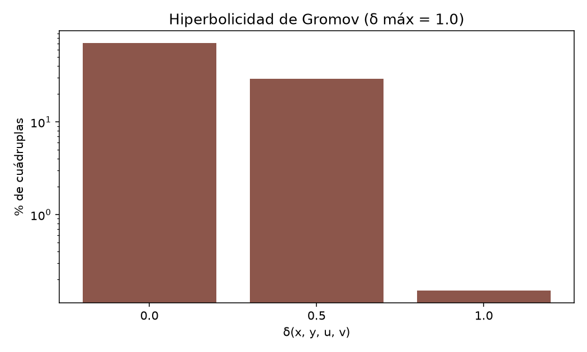

Se muestrearon 200,000 cuádruplas de nodos de la componente gigante. **δ máximo = 1.0** y δ medio = 0.148. Un valor tan pequeño frente al diámetro indica que la red es *similar a un árbol* a gran escala, con curvatura negativa.

| δ | % de cuádruplas |
|---|---|
| 0.0 | 70.622 % |
| 0.5 | 29.227 % |
| 1.0 | 0.150 % |


<!-- FIN:RESULTADOS -->

## ¿Qué representa Δ?

### Matemáticamente

Δ (γ) es el exponente de la ley de potencias $P(k) \propto k^{-\gamma}$, que da la probabilidad de que un AS elegido al azar tenga $k$ vecinos. Tiene tres propiedades clave.

**Invariancia de escala.** Se cumple $P(ak) = a^{-\gamma}P(k)$: la distribución tiene la misma forma a cualquier escala, así que no existe un grado "típico". Por eso se habla de redes *scale-free*.

**Momentos.** El momento $m$-ésimo $\langle k^m \rangle$ diverge cuando $m \ge \gamma - 1$. Con $2 < \gamma < 3$:
- la media $\langle k \rangle$ es finita;
- la varianza $\langle k^2 \rangle$ **diverge** al crecer $N$.

**Grado máximo esperado.** El hub más grande escala como $k_{max} \sim k_{min}\,N^{1/(\gamma-1)}$.

### Topológicamente, en los datos de CAIDA

- **Jerarquía extrema.** La gran mayoría de los AS son *stubs* (clientes finales con 1 a 3 enlaces). Unos pocos Tier-1, grandes carriers y proveedores de contenido acumulan miles de conexiones.
- **Mundo ultra-pequeño.** Con $2 < \gamma < 3$, la distancia media crece como $\langle \ell \rangle \sim \ln \ln N$ (Cohen y Havlin, 2003). Por eso cualquier par de AS está a unos 3–4 saltos.
- **Disasortatividad.** Los hubs se conectan preferentemente con nodos pequeños, es decir, proveedores con clientes, lo que se ve en $r < 0$.
- **Origen.** El mecanismo que explica γ es el **crecimiento con conexión preferencial** (Barabási y Albert, 1999). Un AS nuevo tiende a contratar tránsito con proveedores que ya están muy conectados porque ofrecen mejor alcance: "el rico se hace más rico".

## ¿Para qué sirve Δ en el diseño de redes?

### 1. Resiliencia ante fallos y ataques

Según el criterio de Molloy-Reed, existe una componente gigante mientras $\kappa = \langle k^2 \rangle / \langle k \rangle > 2$. Si se eliminan nodos al azar, el umbral crítico de fragmentación es:

$$f_c = 1 - \frac{1}{\kappa - 1}$$

**Ante fallos aleatorios**, como con $\gamma < 3$ el valor de $\kappa$ diverge, $f_c \to 1$ (Cohen et al., 2000). Internet sobrevive a la caída aleatoria de casi cualquier fracción de AS, porque lo más probable es que caiga un *stub*.

**Ante ataques dirigidos a los hubs**, basta eliminar un pequeño porcentaje de AS para fragmentar la red.

Esta es la propiedad **"robusta pero frágil"** (Albert, Jeong y Barabási, 2000), que el panel (d) de la figura muestra con los datos. Sus implicaciones de diseño son:

- concentrar la redundancia, la protección física y la mitigación DDoS en los nodos de alto grado;
- usar *multihoming*, es decir, contratar varios proveedores de tránsito;
- fomentar el *peering* en IXPs para reducir la dependencia de unos pocos hubs.

### 2. Propagación de amenazas y seguridad del enrutamiento

Con $\gamma \le 3$, el **umbral epidémico tiende a cero** (Pastor-Satorras y Vespignani, 2001). Un gusano, una fuga de rutas (*route leak*) o un secuestro de prefijos BGP (*hijacking*) puede alcanzar toda la red. Por eso la defensa más eficiente es **dirigida a los hubs** (RPKI, filtrado de prefijos, monitoreo) y no aleatoria.

### 3. Enrutamiento

- **Carga y congestión.** En redes libres de escala, el *betweenness* de un nodo crece aproximadamente como su grado. Los hubs concentran el tráfico de tránsito y deben dimensionarse en consecuencia.
- **Escalabilidad de las tablas.** Krioukov et al. (2004, 2007) mostraron que en estas topologías el enrutamiento compacto logra tablas pequeñas con muy poco estiramiento de rutas.
- **Enrutamiento geométrico.** El valor de γ y la hiperbolicidad (ver la nota sobre Gromov) permiten incrustar Internet en un espacio hiperbólico. Así funciona el enrutamiento *greedy* sin tablas globales (Boguñá, Papadopoulos y Krioukov, 2010).

### 4. Optimización y planificación de infraestructura

- **Modelado realista.** Un simulador basado en una red aleatoria de Erdős–Rényi (distribución de Poisson) subestima tanto la vulnerabilidad como la eficiencia real de Internet. Conocer γ permite generar topologías sintéticas fieles para probar protocolos antes de desplegarlos, con modelos como BA, *configuration model*, Inet u Orbis.
- **Planificación de capacidad.** La relación $k_{max} \sim N^{1/(\gamma-1)}$ permite proyectar cómo crecerán los grandes proveedores a medida que se sumen AS.
- **Ubicación de servicios.** Situar IXPs, CDNs, réplicas de DNS raíz y puntos de monitoreo cerca de los hubs maximiza la cobertura con pocos saltos.

## Nota: la δ de Gromov

En la literatura de topología de Internet, la letra **δ** también designa la **constante de hiperbolicidad de Gromov**. Se define con la condición de los cuatro puntos: para cualesquiera nodos $x, y, u, v$, sean $S_1 \ge S_2 \ge S_3$ las sumas $d(x,y)+d(u,v)$, $d(x,u)+d(y,v)$ y $d(x,v)+d(y,u)$. Entonces:

$$\delta(x,y,u,v) = \frac{S_1 - S_2}{2}$$

Una red es δ-hiperbólica si ese valor está acotado por δ para toda cuádrupla. Una δ pequeña significa que la red "se parece a un árbol" a gran escala, con curvatura negativa. Internet tiene δ ≈ 1–2 (Narayan y Saniee, 2011).

Esta δ está relacionada con el exponente de grado. Ambos emergen de una **geometría hiperbólica latente** en la que γ se vincula con la curvatura del espacio (Krioukov et al., 2010). La consecuencia de diseño es que el tráfico tiende a concentrarse en el núcleo de la red.

El script la calcula por defecto, muestreando cuádruplas de nodos de la componente gigante; el resultado aparece en la sección de Resultados.

## Referencias

- Faloutsos, M., Faloutsos, P., & Faloutsos, C. (1999). On power-law relationships of the Internet topology. *ACM SIGCOMM*.
- Barabási, A.-L., & Albert, R. (1999). Emergence of scaling in random networks. *Science*, 286, 509–512.
- Albert, R., Jeong, H., & Barabási, A.-L. (2000). Error and attack tolerance of complex networks. *Nature*, 406, 378–382.
- Cohen, R., Erez, K., ben-Avraham, D., & Havlin, S. (2000). Resilience of the Internet to random breakdowns. *Physical Review Letters*, 85, 4626.
- Pastor-Satorras, R., & Vespignani, A. (2001). Epidemic spreading in scale-free networks. *Physical Review Letters*, 86, 3200.
- Cohen, R., & Havlin, S. (2003). Scale-free networks are ultrasmall. *Physical Review Letters*, 90, 058701.
- Clauset, A., Shalizi, C. R., & Newman, M. E. J. (2009). Power-law distributions in empirical data. *SIAM Review*, 51(4), 661–703.
- Krioukov, D., Papadopoulos, F., Kitsak, M., Vahdat, A., & Boguñá, M. (2010). Hyperbolic geometry of complex networks. *Physical Review E*, 82, 036106.
- Boguñá, M., Papadopoulos, F., & Krioukov, D. (2010). Sustaining the Internet with hyperbolic mapping. *Nature Communications*, 1, 62.
- Narayan, O., & Saniee, I. (2011). Large-scale curvature of networks. *Physical Review E*, 84, 066108.
- Barabási, A.-L. (2016). *Network Science*. Cambridge University Press. <http://networksciencebook.com>
- **Dataset:** The CAIDA AS Relationships Dataset, <snapshot AAAAMMDD>. <https://www.caida.org/catalog/datasets/as-relationships/>

---

**Licencia:** MIT para el código (ver `LICENSE`). Los datos pertenecen a CAIDA y se rigen por sus propios términos de uso.
